Instructions for direct installation from the GitHub repository 
===============================================================

Prerequisites
-----------------

* **Linux users**

-- *OpenSSL and libcurl libraries installed*

&nbsp;


*-> Ubuntu*:

Paste the following command in terminal:

```
sudo apt-get install libssl-dev libcurl4-openssl-dev
```

For other Linux distribution, install a compatible version of the 
*OpenSLL* and *libcurl* libraries. 

&nbsp;&nbsp;


* **Mac users**

-- *Command Line Tools*

Type in a Terminal:

```
xcode-select --install
```

A software update popup will ask if the *Command Line Tools*
must be installed. Press "install".

&nbsp;


-- *XQuartz* 

*XQuartz* can be downloaded from the following link: https://www.xquartz.org/

&nbsp;&nbsp;


* **Windows users**
&nbsp;

-- *Rtools* 

*Rtools* is available at https://cran.r-project.org/bin/windows/Rtools/
&nbsp;


Download and installation
--------------------------

Paste the following command in the R console:

```{r eval=FALSE, include=TRUE}
source("https://goo.gl/u2xraS")
```
&nbsp;


Launching the application
===========================

The interactive application can be launched in R with the following command:

```{r eval=FALSE, include=TRUE}
library('FastqCleaner')
launch_fqc()
```

As an alternative method, an RStudio addin 
(RStudio version 0.99.878 or higher required) installed with the package 
can be found in the Addins menu (Figure 1). 
This button allows the direct launch of the application with a single click.

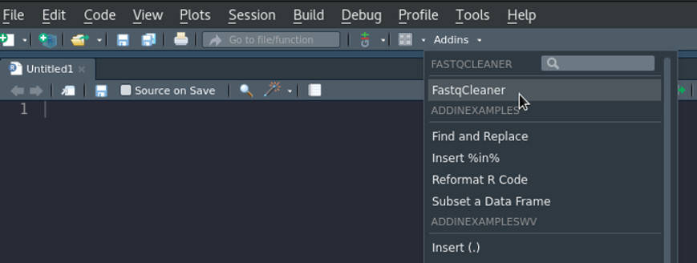
**Figure 1**: addin of the app in RStudio (RStudio version >= 0.99.878 required)


A bird’s eye view to `r Biocpkg("FastqCleaner")`
================================================

The application contains three main panels:


First panel
------------

The first panel includes the "operations menu" and the "input menu" (Fig. 2).


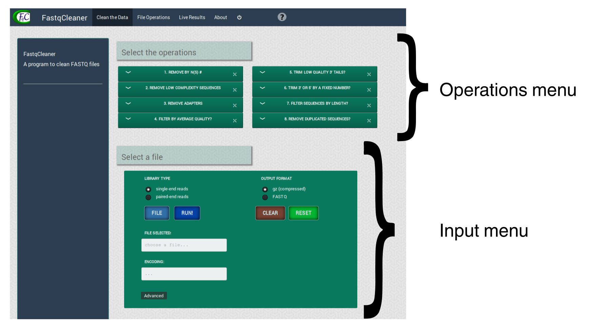

**Figure 2**: First panel of the app

&nbsp;

Second panel
-------------

The second panel shows the operations that were performed to the input file,
after processing (Fig. 3).


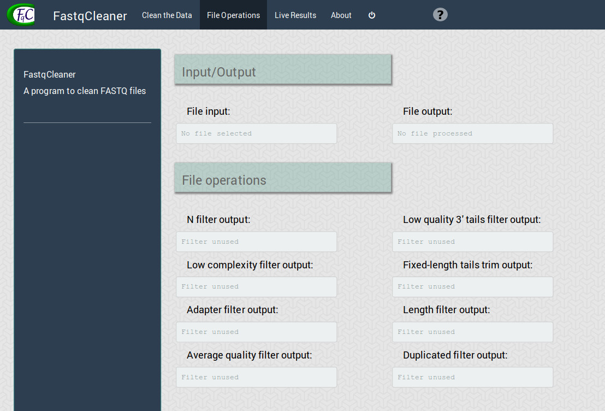

**Figure 3**: Second panel of the app


&nbsp;  


Third panel
------------

The third panel shows interactive plots for diagnostics of input and 
output files (Fig. 4)


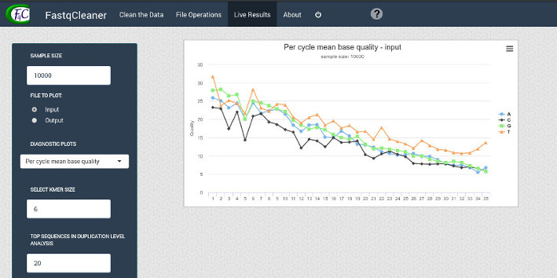

**Figure 4**: Third panel of the app


&nbsp;


Description of the panels
===========================

First panel
---------------

Fig. 5 shows the elements of the the two menus panel. In the next sections 
each manu and its elements are described.  


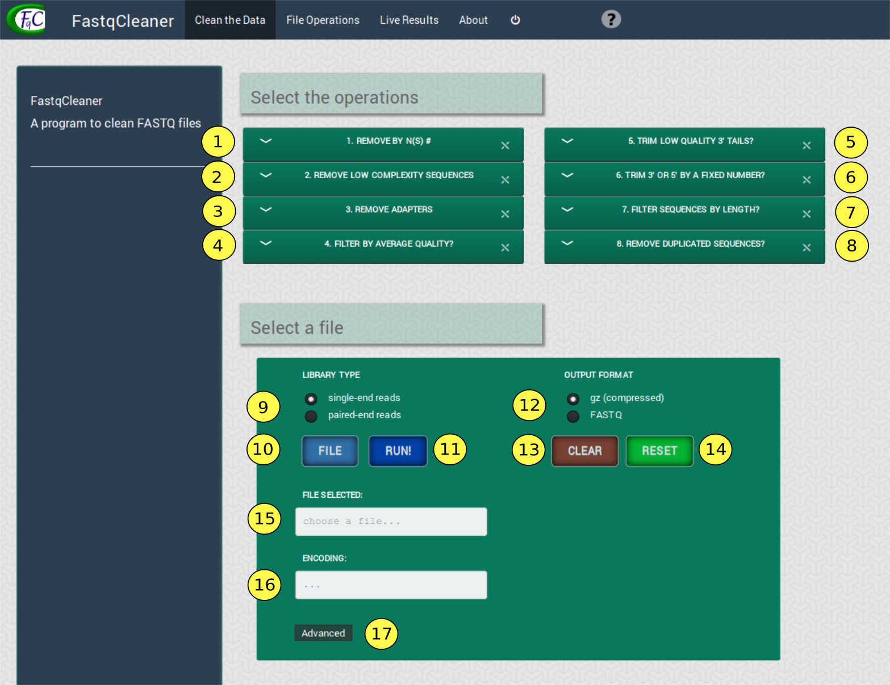

**Figure 5**: Panel 1, with its elements numbered. See explanation 
for each element below

&nbsp;

### Selecting operations

The operations menu (Fig. 6) shows the filters that can be selected 
for file processing.


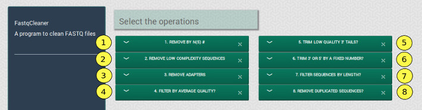

**Figure 6**: Elements of the “operations menu”


1.  **Remove by N(s)**: removes sequences with a number of Ns 
(non identified bases) above a threshold value

2.  **Remove low complexity sequences**: remove sequences with a complexity 
above a threshold value

3.  **Remove adapters**: removes adapters and partial adapters. 
Adapter sequences from both ends of single or paired read reads 
can be selected. The sequences can be reverse-complemented. 
The program also allows to use the filter considering indels 
and/or anchored adapters. Two method can be used for adapter 
remotion: exact or error rate. The methods are based on 
lower-level `r Biocpkg("Biostrings")` infrastructure, working 
as the function trimLRpatterns, but optimized for both anchored 
and non anchored adapters

4.  **Filter by average quality**: computes the average quality of sequences 
and removes those with a value below a given threshold

5.  **Trim low quality 3’ tails**: removes the 3’ tails of sequences that
are below a given threshold

6.  **Trim 3’ or 5’ by a fixed number**: removes a fixed number of bases 
from the 3’ and/or 5’ ends in the complete set of sequences

7.  **Filter sequences by length**: removes all the sequences with a number 
of bases below a threshold value

8.  **Remove duplicated sequences**: removes duplicated reads, conserving
only one copy of each sequence present in the file


### Loading files

The file selection menu (Fig. 7) contains the options for file loading, 
operations and application resetting, and the “advanced” submenu.

&nbsp;


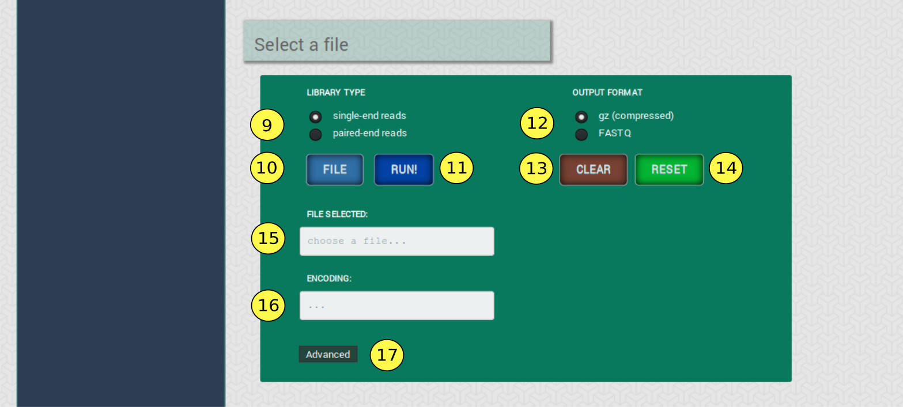

**Figure 7**: File selection menu

&nbsp;


9.  **Single-end reads / paired-end reads**: type of input files

10.  **“FILE” button**: to select an input file

11.  **“RUN!” button**: to run the program

12.  **Output format**: to select if the output file should be compressed 
(.gz) or not

13.  **“CLEAR” button**: to clear the configuration of the operations menu 
that have been selected in the first panel, but keeping the input file(s)

14.  **“RESET” button**: to reset completly the application, removing the 
input file(s) and the selected configurations

15.  **Selection notificator**: it indicates the path of the selected file

16.  **Encoding notificator**: it indicates the input file encoding

17.  **Advanced options button**: to select a custom encoding and to set 
the number of reads included in each chunk for processing, as described below


### Advanced options

The advanced options submenu (Fig. 8) allows to customize some fine aspects 
of file processing.


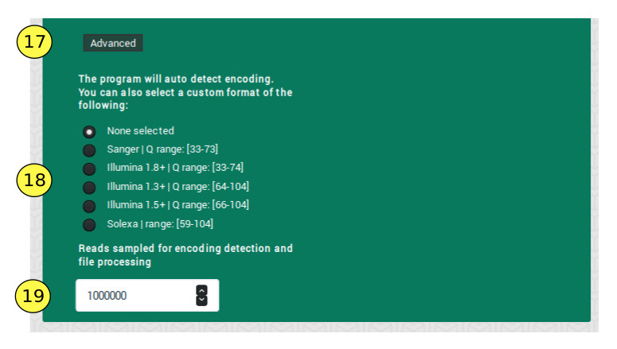

**Figure 8**: advanced options submenu

&nbsp;


18.  **Encoding menu**: In addition to the default approach used for the 
program (auto-detection of file encoding), the user can select from a list
of standard encodings

19.  **Chunk size**: the program takes a random sample of the file with number 
of reads = chunk size (default: 1000000), for detection of the file encoding


&nbsp;


Second panel
----------------

The “File Operations” panel (Fig. 9) indicates post-processing information.

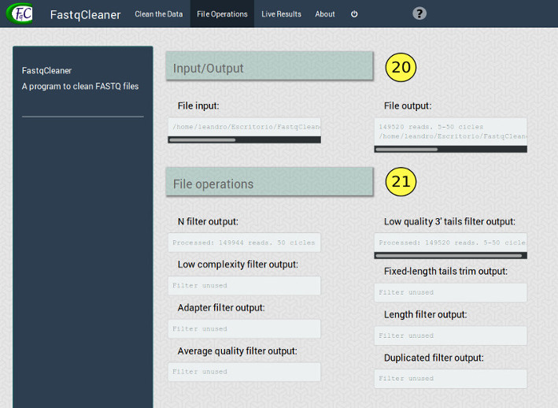

**Figure 9**: File operations panel, with its elements

&nbsp;  


The elements of the panel are the following:

20.  **Files location**: Location of input and output files

21.  **Operations performed**: Operations perfomed on the input file, after 
the program run. Each individual display indicates the number of reads that
passed the corresponding filter


&nbsp;


Third panel
---------------

The “Live Results” panel (Fig. 10) shows diagnostic plots, for both the 
input and/or output files. The program takes a random sample of reads for 
construction of the plots (default: 1000 reads).


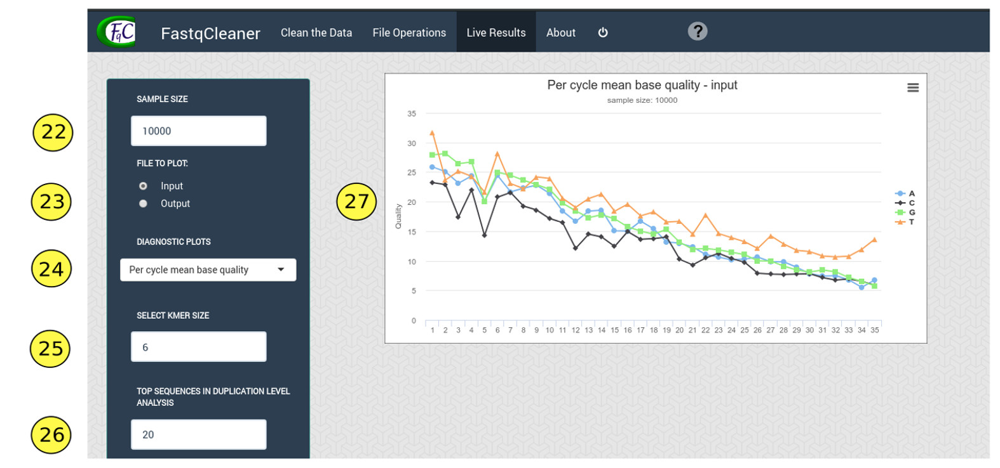

**Figure 10**: Live results panel


&nbsp;


The panel includes the following options in the menu located on the left:

22. **Sample size**: the sample size used for construction of the plots. 
Default: 10000 reads

23. **Input / output**: ¿show diagnostics plots for the input or output files?

24. **Diagnostics plots**: the plot to be shown, that can be one of the 
following:


    *   _Per cycle quality_: quality plots across reads for each cycle 
    (i.e., sequence position)

    *   _Per cycle mean quality_: average quality across reads per base, 
    for each cycle (i.e., sequence position)

    *   _Mean quality distribution_: Quality distribution, using for 
    the construction of the histogram the mean quality of each read

    *   _% reads with Phred scores > threshold_: % of reads with with all 
    the quality values > threshold

    *   _Per cycle base proportion_: Proportion of each base 
    (average across reads) in each cycle. It also shows the proporion of N’s

    *   _CG content_: % CG and % AT (average across reads) for each cycle

    *   _CG content distribution over all reads_: histogram for % reads with 
    a given % CG

    *   _Read length distribution_: % reads vs read length (bp)

    *   _Read ocurrence distribution_: % reads that ocurr at different 
    frequencies values in the file. The plot also includes a table

    *   _Relative k-mer diversity_: relation of unique k-mers/ all posible 
    kmers for each cycle


25. **Select k-mer size**: k-mer size for the k-mers frequency plot

26. **Top sequences in duplication level analysis**: a list of duplicated 
sequences can be desplegated from the "read ocurrence distribution" plot. 
The number selected indicates the number of sequences to be show, ordered 
from high to low duplication level. 
Note that the frequency of reads are relative to the sample size selected 
(i.e, fold-times respect to the reads present only one time in the sample)

27. **Plot panel**

&nbsp;&nbsp;


A worked example: FASTQ processing in a nutshell
==================================================

A sample FASTQ (gz-compressed) file 'example.fastq.gz' for testing can 
be downloaded with the following command in R:

```{r eval=FALSE, include=TRUE}
download.file("https://goo.gl/hb4Kr9", "example_fastq.gz")
```

A direct download is provided in <a href="https://goo.gl/hb4Kr9"> 
this link </a>.
&nbsp;

A tipical `r Biocpkg("FastqCleaner")` workflows starts with the loading of 
the input file/s (Figs. 11, 12).


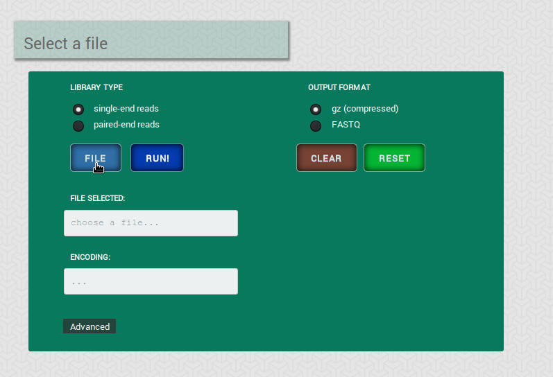
**Figure 11**: File input menu. The example shows a single-end reads case 
(sample file 'example.fastq.gz'). For paired-end reads, the selection of the
corresponding library type generates an additional button for loading the 
second file


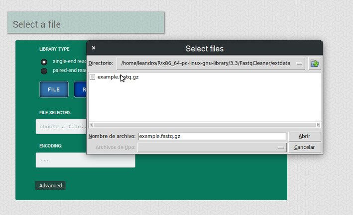

**Figure 12**: When the "FILE" button is pressed, a browser for file selection 
will appear

&nbsp;  

The file encoding is detected automatically by the program, but it can also be 
manually specified in the advanced submenu (Fig. 13). This menu also allows to 
customize the chunk size used for processing.


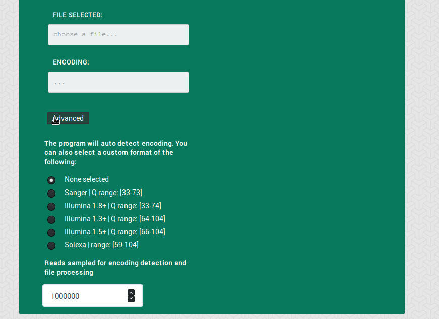

**Figure 13**: Advanced submanu

&nbsp;

Next, the operations to be performed on the input file are selected from the
operations menu (Fig. 14).

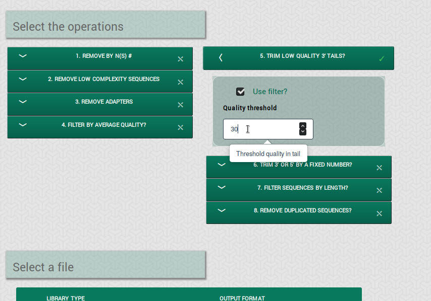

**Figure 14**: Example of operations selection. A dialog shows the expected 
input in the box. For activating the filter, the “Use filter?” checkbox must
be checked. An activated filter is indicated with a tickmarck in the box of 
the filter

&nbsp;  

The program is then run by pressing the “RUN!” button (Figs. 15, 16).


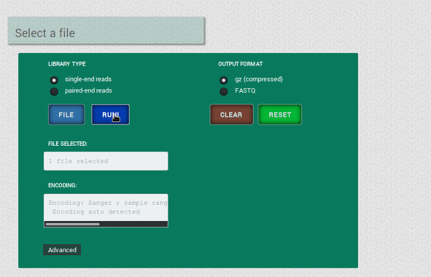

**Figure 15**: "RUN!" button action

&nbsp;    


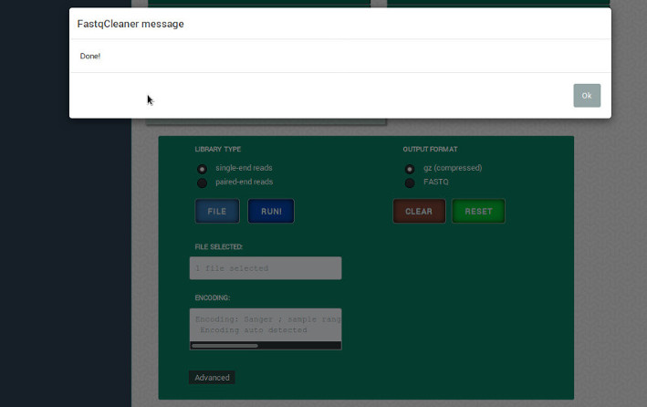

**Figure 16**: Message after a sucessful run of the program

&nbsp;  

The processing results are shown in the second panel (Fig. 17).  


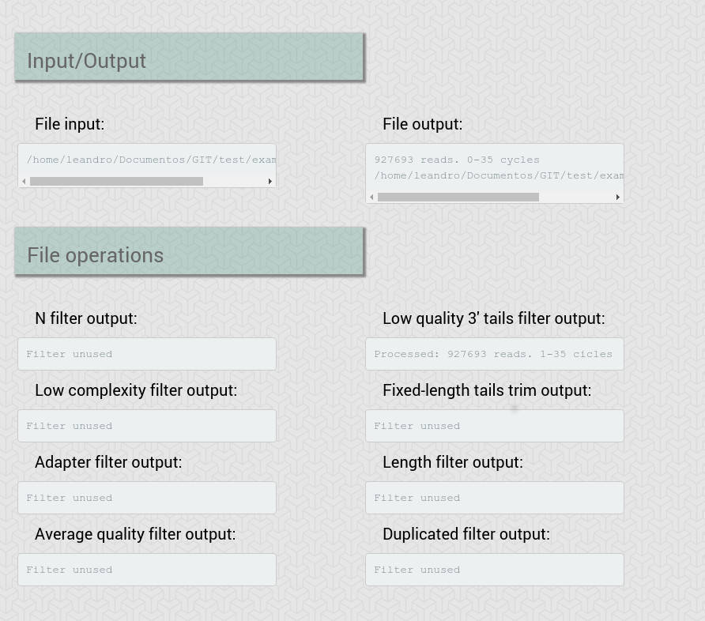

**Figure 17**: Second panel of the app, showing the operations performed and 
the paths of the input and output files

&nbsp;  


The type of plot to be displayed and the options for the construction of the
plot are available in the third panel (Fig. 18). This panel also contains the
plots.


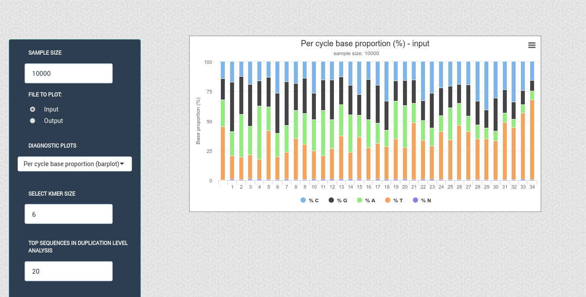

**Figure 18**: Third panel, showing a “CG” content plot. 
The plot corresponds to the output file. Note that this can be 
modified from the lateral menu, in addition to other options

&nbsp;    

To clean the operations, for example for running the file using other
configuration, the "CLEAN" button must be pressed (Fig. 19).


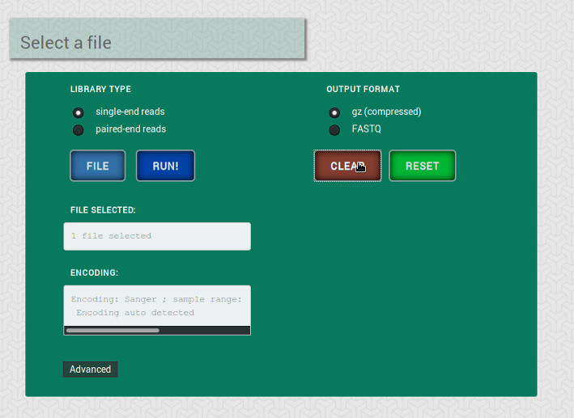

**Figure 19**: Clean button

&nbsp;  


The "RESET" button (Fig. 20) sets the interface at its inital state 
(i.e., any file or operations are selected).


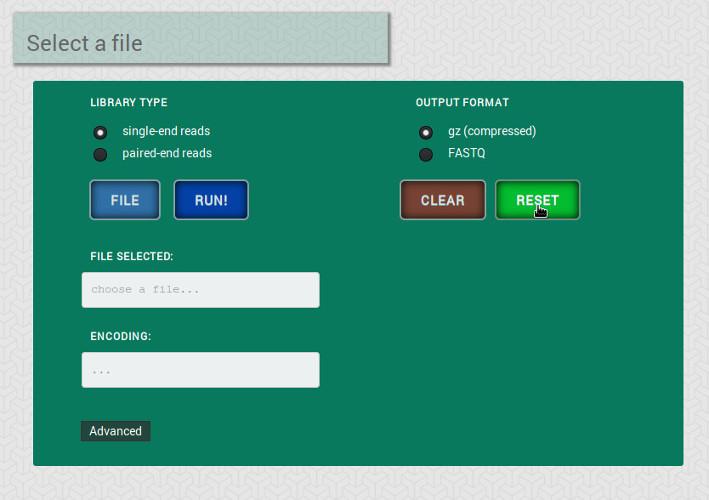

**Figure 20**: "RESET" button

&nbsp;    

Additional help can be found pressing the "help" element the top-right
of the app (Fig. 21).


**Figure 21**: help button. A webpage with help will be open

&nbsp;


Advanced use of the package
=============================

`r Biocpkg("FastqCleaner")` processing functions are accesible from the 
R command line as standard functions. Most of the functions make intensive 
use of `r Biocpkg("Biostrings")` and `r Biocpkg("ShortRead")` packages in 
the background. The complete documentation of the functions is accesible 
following [this link](docs/reference/index.html)

The functions included in the package are described in the following section.

&nbsp;

Main functions
------------------

*   **adapter_filter**

Based on the `r Biocpkg("Biostrings")` isMatchingStartingAt and 
isMatchingEndingAt functions. It can remove adapters and partial adapters
from the 3’ and 5’ sequence ends. Adapters can be anchored or not.
Two methods are available: one based on the exact matching of the 
sequences and the adapter, and other in a mismatch rate. In the latter,
when indels are allowed, the method is based on the “edit distance” of
the sequences.


```{r eval=TRUE, echo=TRUE}
### Examples
```
```{r include=FALSE}
require("Biostrings")
require("ShortRead")
require("FastqCleaner")
set.seed(10)
```

```{r eval = FALSE}
require("Biostrings")
require("ShortRead")
require("FastqCleaner")
set.seed(10)
```

```{r eval=TRUE, echo=TRUE}

# create sequences
input <- random_seq(6, 43, seed = 10)
input

# create qualities of width 50
input_q <- random_qual(c(30,40), slength = 6, swidth = 50, seed = 10, 
encod = "Sanger")

# create names
input_names <- seq_names(length(input))


### FULL ADAPTER IN 3'
adapter <- "ATCGACT"

# Create sequences with adapter
my_seqs <- paste0(input, adapter)
my_seqs <- DNAStringSet(my_seqs)
my_seqs

# create ShortReadQ object
my_read <- ShortReadQ(sread = my_seqs, quality = input_q, id = input_names)

# trim adapter
filtered <- adapter_filter(my_read, Lpattern = adapter)
sread(filtered)

### PARTIAL ADAPTER IN 5'
adapter <- "ATCGACT"
subadapter <- subseq(adapter, 1, 4)

# Create sequences with adapter
my_seqs <- paste0(input, subadapter)
my_seqs <- DNAStringSet(my_seqs)
my_seqs

# create ShortReadQ object
my_read <- ShortReadQ(sread = my_seqs, quality = subseq(input_q, 1, 47), 
id = input_names)

# trim adapter
filtered <- adapter_filter(my_read, Rpattern = adapter)
sread(filtered)

```


[Documentation of the function](docs/reference/adapter_filter.html)

&nbsp;

*   **complex_filter**

Removes low complexity sequences, computing the entropy with the 
dinucleotide frequency: 
$$H_i = -\sum d_i * log_2(d_i)$$

where: $d_i = D_i/ \sum_i^n D_i$ represents the frequency of 
dinucleotides of the sequence $i$ relative to the frequency 
in the whole pool of sequences. 

The relation $H_i/H_r$ between $H_i$ and a reference entropy value $H_r$ 
is computed, and the obtained relations are compared with a given complexity 
threshold.  By default, for the reference entropy the program uses a value 
of 3.908, that corresponds to the entropy of the human genome in bits, 
and a complexity threshold of 0.5.


```{r}

# create  sequences of different width

input <- lapply(c(0, 6, 10, 16, 20, 26, 30, 36, 40), 
            function(x) random_seq(1, x, seed = 10))


# create repetitive "CG" sequences with length adequante 
# for a total length input +  CG = 40

CG <- lapply(c(20, 17, 15, 12, 10, 7, 5, 2, 0), 
            function(x) paste(rep("CG", x), collapse = ""))

# concatenate input and CG
input  <- mapply("paste", input, CG, sep = "")
input <- DNAStringSet(input)
input

# plot relative entropy (E, Shannon 1948)
H_plot <- function(x, H_max = 3.908135) {
    freq <- dinucleotideFrequency(x)
    freq  <- freq /rowSums(freq)
    H <- -rowSums(freq  * log2(freq), na.rm = TRUE)
    plot(H/H_max, type="l", xlab = "Sequence", ylab= "E")
    points(H/H_max, col = "#1a81c2", pch = 16, cex = 2)
}

H_plot(input)
```

**Figure 22**: Relative entropy plot for the sequences befor the operation

```{r}
# create qualities of widths 40

input_q <- random_qual(c(30,40), slength = 9, swidth = 40, 
        seed = 10, encod = "Sanger")

# create names
input_names <- seq_names(9)


# create ShortReadQ object
my_read <- ShortReadQ(sread = input, quality = input_q, id = input_names)

# apply the filter, 
filtered <- complex_filter(my_read)
sread(filtered)

H_plot(sread(filtered))
```
**Figure 23**: Relative entropy plot for the sequences after the operation


[Documentation of the function](docs/reference/complex_filter.html)

&nbsp;

*   **fixed_filter**

Removes the specified number of bases from 3’ or 5’ in the set of sequences.

```{r}

# create sequences, qualities and names of width 20

input <- random_seq(6, 20, seed = 10)
input

input_q <- random_qual(c(30,40), slength = 6, swidth = 20, 
seed = 10, encod = "Sanger")

input_names <- seq_names(6)

# create ShortReadQ object
my_read <- ShortReadQ(sread = input, quality = input_q, id = input_names)

# apply the filter 
filtered3 <- fixed_filter(my_read, trim5 = 5)
sread(filtered3)

filtered5 <- fixed_filter(my_read, trim3 = 5)
sread(filtered5)

filtered3and5 <- fixed_filter(my_read, trim3 = 10, trim5 = 5)
sread(filtered3and5)

```


[Documentation of the function](docs/reference/fixed_filter.html)

&nbsp;

*   **length_filter**

Removes the sequences from a FASTQ file with a length lower than
rm.min or/and higher than rm.max.

```{r}

# create  ShortReadQ object width widths between 1 and 60
input <- random_length(10, widths = 1:60, seed = 10)
sread(input)

# apply the filter, removing sequences with  5>length> 30
filtered <- length_filter(input, rm.min = 5, rm.max = 30)
sread(filtered)
```


[Documentation of the function](docs/reference/length_filter.html)

&nbsp;

*   **n_filter**

Wrapper of the `r Biocpkg("ShortRead")` nFilter function. Removes 
the sequences with a number of N’s above a threshold value “rm.N”. 
All the sequences with a number of N > rm.N will be removed.

```{r}
# create 10 sequences of width 20
input <- random_seq(10, 20, seed = 10)
input

# inject N's
input <- inject_letter_random(input, how_many_seqs = 1:5,
            how_many = 1:10, seed = 10)
input

#'  
hist(letterFrequency(input, "N"), breaks = 0:10, 
    main  = "Ns Frequency", xlab = "# Ns",
    col = "#1a81c2")
```
**Figure 24**: N's histogram for the sequences after the filtering operation

```{r}

# Create qualities, names and ShortReadQ object
input_q <- random_qual(10, 20, seed = 10)
input_names <- seq_names(10)
my_read <- ShortReadQ(sread = input, quality = input_q, id = input_names)

# Apply the filter 
filtered <- n_filter(my_read, rm.N = 3)
sread(filtered)
hist(letterFrequency(sread(filtered), "N"), 
    main = "Ns distribution", xlab = "",
    col = "#1a81c2")
```

**Figure 25**: N's histogram for the sequences after the filtering operation

[Documentation of the function](docs/reference/n_filter.html)

&nbsp;

*   **qmean_filter**

Removes the sequences with a quality lower than a “minq” threshold.

```{r}

# create 30 sequences of width 20, 15 with low quality and 15 with high quality
input <- random_seq(30, 20, seed = 10)

my_qual_H <- random_qual(c(30,40), slength = 15, swidth = 20,
                        seed = 10, encod = "Sanger")

my_qual_L <-   random_qual(c(5,30), slength = 15, swidth = 20, 
                        seed = 10, encod = "Sanger")
input_q<- c(my_qual_H, my_qual_L)

input_names <- seq_names(30)
my_read <- ShortReadQ(sread = input, quality = input_q, id = input_names)

# Plot of average qualities
qual_plot <- function(x, cutoff) {
q <- alphabetScore(x) / width(x)
plot(q, type="l", xlab = "Sequence", ylab= "Average quality", ylim = c(0, 40))
points(q, col = "#1a81c2", pch = 16, cex = 2)
lines(seq_along(q), rep(cutoff, length(q)), type="l", col = "red", lty=2)
text(length(q), cutoff+2, cutoff)
}

#' Average qualities before
qual_plot(my_read, cutoff = 30)
```

**Figure 26**:  Average qualities before the filtering operation

```{r}
# Apply the filter
filtered <- qmean_filter(my_read, minq = 30)

# Average qualities after
qual_plot(filtered, cutoff = 30)

```
**Figure 27**:  Average qualities after the filtering operation

[Documentation of the function](docs/reference/qmean_filter.html)

&nbsp;

*   **seq_filter**

Removes a set of sequences from a FASTQ file.


```{r}

# Generate random sequences
input <- random_length(30, 3:7, seed = 10)

# Remove sequences that contain the following patterns:
rm.seq  = c("TGGTC", "CGGT", "GTTCT", "ATA")
match_before <- unlist(lapply(rm.seq, function(x) grep(x, 
as.character(sread(input)))))
match_before

filtered <- seq_filter(input,rm.seq =  rm.seq)

# Verify that matching sequences were removed
match_after <- unlist(lapply(rm.seq, function(x) {
                grep(x, as.character(sread(filtered)))}))
match_after
```

[Documentation of the function](docs/reference/seq_filter.html)

&nbsp;

*   **trim3q_filter**

Removes from the 3’ ends nucleotides in-tandem with a quality 
below a threshold value.


```{r}

# Create 6 sequences of width 20
input <- random_seq(6, 20, seed = 10)
input

# Create Phred+33 qualities of width 15 and paste to qualities of length 
# 5 used for the tails.
# for three of the sequences, put low qualities in tails

my_qual <- random_qual(c(30,40), slength = 6, swidth = 15, seed = 10, 
                        encod = "Sanger")
tails <-   random_qual(c(30,40), slength = 6, swidth = 5, seed = 10, 
                        encod = "Sanger")

# Low quality tails in sequences 2, 3 & 4
tails[2:4] <- random_qual(c(3, 20), slength = 3, swidth = 5, seed = 10,
                        encod = "Sanger")
my_qual <- paste0(my_qual, tails)
input_q <- BStringSet(my_qual)
input_q

# Watch qualities before filtering
as.matrix(PhredQuality(input_q))

# Create names and ShortReadQ object
input_names <- seq_names(6)
my_read <- ShortReadQ(sread = input, quality = input_q, id = input_names)

# Apply the filter 
filtered <- trim3q_filter(my_read, rm.3qual = 28)
sread(filtered)

```


[Documentation of the function](docs/reference/trim3q_filter.html)

&nbsp;

*   **unique_filter**

Wrapper to the `r Biocpkg("ShortRead")` occurrenceFilter function. 
It removes the duplicated sequences of a FASTQ file.

```{r}

# Create duplicated sequences
s <- random_seq(10, 10)
s <- sample(s, 30, replace = TRUE)

# Create a ShortReadQ object
q <- random_qual(30, 10)
n <- seq_names(30)
my_read <- ShortReadQ(sread = s, quality = q, id = n)

# Check presence of duplicates
isUnique(as.character(sread(my_read)))

# Apply the filter
filtered <- unique_filter(my_read)
isUnique(as.character(sread(filtered)))
```


[Documentation of the function](docs/reference/unique_filter.html)

&nbsp;

*   **cutRseq / cutLseq**

The functions use the `r Biocpkg("Biostrings")` isMatchingStartingAt 
and isMatchingEndingAt functions to find matches between the sequences
of a FASTQ input and adapter sequences. IUPAC symbols are allowed
in all the cases. The difference with the `r Biocpkg("Biostrings")` 
trimLRpatterns function is that the present also removes partial adapters,
without the need of additional steps (for example, creating a padded adapter
with ‘Ns’, loosing the possibility of using IUPAC symbols). A similar result
of the obtained with `r Biocpkg("Biostrings")` trimLRpatterns when the raw
adaptor is passed to `r Biocpkg("FastqCleaner")` with the option 
anchored = TRUE. When several matches are found, the function removes
the subsequence starting from the first match in cutRseq, and ending
in the last one in cutLseq.

```{r}

# Create sequnces and adapters
subject <- DNAStringSet(c("ATCATGCCATCATGAT", "CATGATATTA", 
                        "TCATG", "AAAAAA", "AGGTCATG"))
subject

Lpattern <- Rpattern <- "TCATG"

# Remove left pattern
cutLseq(subject, Lpattern, anchored = FALSE, ranges = FALSE)
# Get ranges
cutLseq(subject, Lpattern, anchored = FALSE, ranges = TRUE)

# Remove right pattern
cutRseq(subject, Rpattern, anchored = FALSE, ranges = FALSE)

# Remove left pattern, anchored
cutLseq(subject, Lpattern, anchored = TRUE, ranges = FALSE)

# Remove left pattern, using error rate
cutLseq(subject, Lpattern, method = "er", error_rate = 0.2, ranges = FALSE)

# Remove left pattern using error rate and indels
cutLseq(subject, Lpattern, method = "er", error_rate = 0.2, with.indels = TRUE, 
        ranges = FALSE)

# Remove right pattern
cutRseq(subject, Rpattern, anchored=TRUE, ranges = FALSE)
```


[Documentation of the functions](docs/reference/remove-adapters.html)

&nbsp;


Auxiliary functions
--------------------

*   **random_seq**

Create a vector of random sequences, for a set of specificied parameters.

[Documentation of the function](docs/reference/random_seq.html)

&nbsp;

*   **random_qual**

Create a vector of random qualities for a given encoding and a set
of specified parameters.

[Documentation of the function](docs/reference/random_qual.html)


&nbsp;


*   **seq_names**

Create a vector of names for a set of sequences.

[Documentation of the function](docs/reference/seq_names.html)

&nbsp;

*   **random_length**

Create a set of sequences with random lengths

[Documentation of the function](docs/reference/seq_names.html)

&nbsp;

*   **inject_letter_random**

Inject a character (e.g., 'N') at random position, given a set of parameters.


[Documentation of the function](docs/reference/inject_letter_random.html)

&nbsp;

*   **check_encoding**

The function allows to check quality encoding. It detects encodings with
the following formats:

Format       | Expected range
-------------|------------------
Sanger       |     [0, 40]  
Illumina 1.8 |     [0, 41]  
Illumina 1.5 |     [0, 40]  
Illumina 1.3 |     [3, 40]  
Solexa       |     [-5, 40]

[Documentation of the function](docs/reference/check_encoding.html)

&nbsp;


Contact information
=====================

Mantainer: Leandro Roser - [learoser@gmail.com](mailto:learoser@gmail.com)  

&nbsp;
