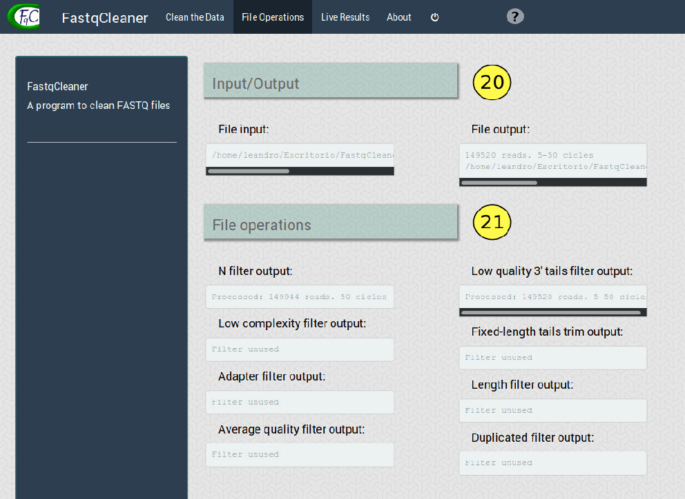
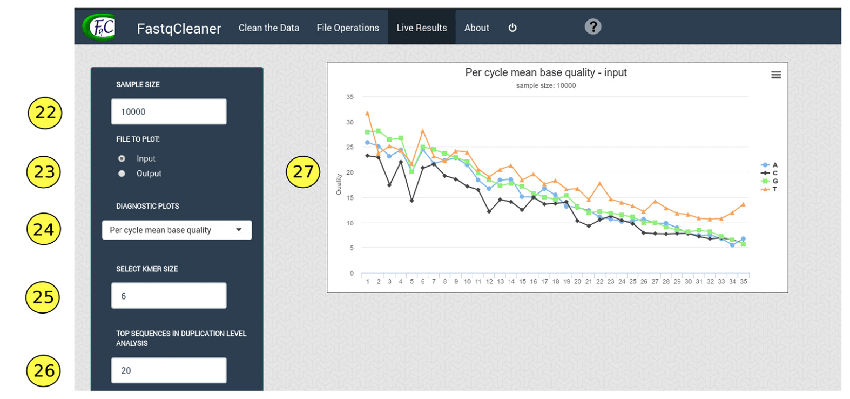
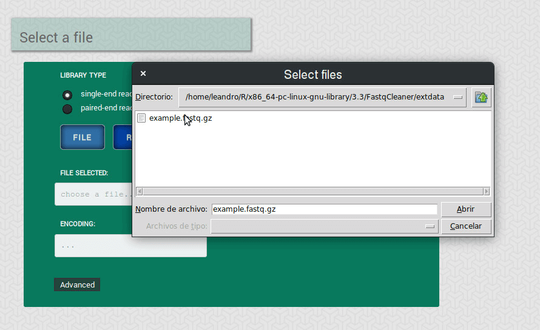
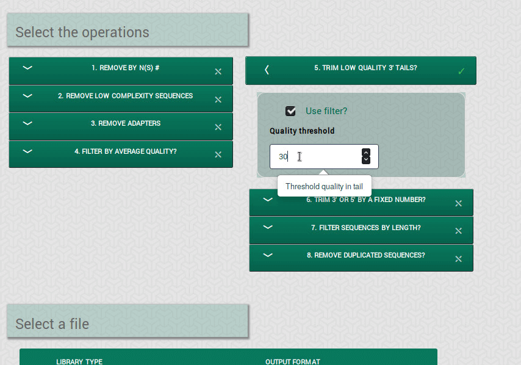
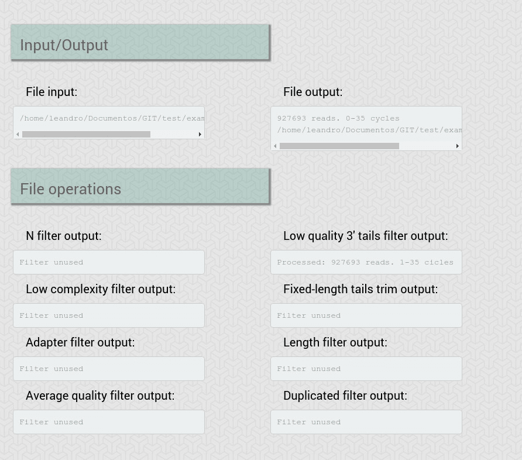

Launching the application
===========================

The interactive application can be launched in R with the following command:

```{r eval=FALSE, include=TRUE}
library('FastqCleaner')
launch_fqc()
```

As an alternative method, an RStudio addin 
(RStudio version 0.99.878 or higher required) installed with the package 
can be found in the Addins menu (Figure 1). 
This button allows the direct launch of the application with a single click.


**Figure 1**: addin of the app in RStudio (RStudio version >= 0.99.878 required)

&nbsp;


Description of the application
===============================

The application contains three main panels, as described below. 

First panel
---------------

The first panel includes two elements: a dashboard for selection 
of trimming and  filtering operations, and a menu for selection 
of the input file/s (Fig. 2). 


**Figure 2**: Panel 1, with each compontent indicated with a number.
See explanation for each element below

&nbsp;

### Selecting operations

The "operations menu" (Fig. 2, elements 1 to 8) shows 
the available operations for file processing:

1.  **Remove by N(s)**: removes sequences with a number of Ns 
(non identified bases) above a selected threshold value

2.  **Remove low complexity sequences**: remove sequences with a value of 
complexity above a threshold value

3.  **Remove adapters**: removes adapters and partial adapters. 
Adapter sequences from both ends of single or paired read reads 
can be selected. Sequences can be reverse-complemented before processing. 
The program also allows to consider indels 
and/or anchored adapters. Two method can be used for adapter 
remotion: "exact" or "error rate". The methods are based on 
lower-level `r Biocpkg("Biostrings")` infrastructure, working 
as the function trimLRpatterns, but optimized for both anchored 
and non anchored adapters

4.  **Filter by average quality**: computes the average quality of sequences 
and removes those with a value below a given threshold

5.  **Trim low quality 3’ tails**: removes the 3’ tails of sequences that
are below a given threshold

6.  **Trim 3’ or 5’ by a fixed number**: removes a fixed number of bases 
from the 3’ and/or 5’ ends in the complete set of sequences

7.  **Filter sequences by length**: removes all the sequences with a number 
of bases below a threshold value

8.  **Remove duplicated sequences**: removes duplicated reads, conserving
only one copy of each sequence present in the file


### Loading files

The "file selection menu" (Fig. 2, elements 9 to 17) 
contains options to handle the input file (type of file, file selection), 
buttons to run, clear and reset the aplication, and the “advanced” submenu:


9.  **Single-end reads / paired-end reads**: type of input files

10.  **“FILE” button**: to select an input file

11.  **“RUN!” button**: to run the program

12.  **Output format**: to select whether the output file should be compressed 
(.gz) or not

13.  **“CLEAR” button**: to clear the configuration of the operations menu 
that have been selected in the first panel, but keeping the input file(s)

14.  **“RESET” button**: to restart the application, removing the 
input file(s) and the selected configurations

15.  **Selection notificator**:  information of the path of the selected file/s

16.  **Encoding notificator**: information of the input file/s encoding

17.  **Advanced options button**: to select a custom encoding and set 
the number of reads included in each chunk for processing, as described below


### Advanced options

The "advanced options submenu" (Fig. 3) allows to customize some fine aspects 
of the trimming and filtering process:


**Figure 3**: Advanced options submenu

&nbsp;


18.  **Encoding menu**: in addition to the default approach used by the 
program (auto-detection of file encoding), users can select a standard encoding 
from a list

19.  **Chunk size**: the program takes this number of reads at random from
the file (default: 1000000), for encoding detection


&nbsp;


Second panel
----------------


The second panel (“file operations” panel, Fig. 4) shows the operations 
that were sucessfuly performed on the input file after running the program.




**Figure 4**: File operations panel, with its elements

&nbsp;  


The panel contains the following elements: 

20.  **Files location**: location of input and output files

21.  **Operations performed**: operations perfomed on the input file.
Each individual display indicates the number of reads that
passed the corresponding filter


&nbsp;


Third panel
---------------


The third panel ( “live results” panel, Fig. 5) shows 
interactive diagnostics plots for both input and output files. 
The program takes a random sample of reads for 
construction of the plots (default: 10000 reads).




**Figure 5**: Live results panel


&nbsp;


The panel includes the following options in the menu located on the left:

22. **Sample size**: the sample size used for construction of the plots. 
Default: 10000 reads

23. **Input / output**: show diagnostics plots for input or output files?

24. **Diagnostics plots**: the plot to be shown, that can be one of the 
following:


    *   _Per cycle quality_: quality plots across reads for each cycle 
    (i.e., sequence position)

    *   _Per cycle mean quality_: average quality across reads per base, 
    for each cycle (i.e., sequence position)

    *   _Mean quality distribution_: Quality distribution, using for 
    the construction of the histogram the mean quality of each read

    *   _% reads with Phred scores > threshold_: % of reads with all 
    the quality values > threshold

    *   _Per cycle base proportion_: Proportion of each base 
    (average across reads) in each cycle. It also shows the proporion of N’s

    *   _CG content_: % CG and % AT (average across reads) for each cycle

    *   _CG content distribution over all reads_: histogram for % reads with 
    a given % CG

    *   _Read length distribution_: % reads vs read length (bp)

    *   _Read ocurrence distribution_: % reads that ocurr at different 
    frequencies values in the file. The plot also includes a table

    *   _Relative k-mer diversity_:  unique k-mers / all posible 
    kmers for each cycle


25. **Select k-mer size**: k-mer size for the k-mers frequency plot

26. **Top sequences in duplication level analysis**: a list of duplicated 
sequences, ordered from high to low duplication level,
can be desplegated from the "read ocurrence distribution" plot. 
The number selected here indicates how many sequences should be shown.
Note that the frequency of reads are relative to the sample size selected 
(i.e., fold-times in relation to those reads present only once in the sample)

27. **Plot panel**

&nbsp;&nbsp;


A worked example: FASTQ processing in a nutshell
==================================================

A sample FASTQ (gz-compressed) file 'example.fastq.gz' can 
be downloaded with the following command in R:

```{r eval=FALSE, include=TRUE}
download.file("https://goo.gl/hb4Kr9", "example_fastq.gz")
```

A direct download is provided in <a href="https://goo.gl/hb4Kr9"> 
this link </a>.
&nbsp;

A tipical `r Biocpkg("FastqCleaner")` workflow starts with the input file/s 
upload (Fig. 6).




**Figure 6**: File input menu. The example shows a single-end reads case 
(sample file 'example.fastq.gz'). For paired-end reads, the selection of the
corresponding library type generates an additional button to upload the 
second file.

&nbsp;  

The file encoding is automatically detected by the program, but it can also be 
manually specified in the advanced submenu (Fig. 7). This menu also offers an
option to customize the chunk size used for processing.


**Figure 7**: Advanced submanu

&nbsp;

Next, the operations to be performed on the input file are selected from the
operations menu (Fig. 8).



**Figure 8**: Selection of operations. A dialog box shows the input expected 
for the program. To use a filter, the “Use filter?” checkbox must
be checked. A filter in use is indicated with a checkmark in the filter box 

&nbsp;  

The program then starts to run after pressing the “RUN!” button (Fig. 9).


**Figure 9**: "RUN!" button action

&nbsp;    


Post-processing results are shown in the second panel (Fig. 10).  




**Figure 10**: Second panel of the app, showing the operations performed and 
the paths of the input and output files

&nbsp;  


The type of plot to be displayed and the options for the construction of the
plot are available in the third panel (Fig. 11). This panel also show the
selected plot/s.


**Figure 11**: Third panel, showing as example a “CG” content plot. 
for the output file

&nbsp;    

To clean the operations, for example to run a different
configuration, the "CLEAN" i(Fig. 11) must be pressed. The "RESET" button 
(Fig. 11) restarts the interface.


&nbsp;    

Additional help can be found in the "help" button located at the top-right
of the app (Fig. 12).


**Figure 12**: help button. A webpage with information will be open

&nbsp;


Advanced use of the package
=============================

`r Biocpkg("FastqCleaner")` separates the interface from the implementation. 
In consequence, the processing functions of the package can be used 
as standard functions from the command line. 
Most of the functions make intensive 
use of `r Biocpkg("Biostrings")` and `r Biocpkg("ShortRead")`. Trimming
and filtering is performed on ShortReadQ objects. A complete documentation 
for the functions is available in [this link](docs/reference/index.html)

The functions included in the package are described in the following section.

&nbsp;

Main functions
------------------

*   **adapter_filter**

Based on the `r Biocpkg("Biostrings")` isMatchingStartingAt and 
isMatchingEndingAt functions. It can remove adapters and partial adapters
from the 3’ and 5’ sequence ends. Adapters can be anchored or not.
Two methods are available: one based on the exact matching of the 
sequences and the adapter, and other in a mismatch rate. For this latter,
when indels are allowed, the method is based on the “edit distance” of
the sequences.


```{r eval=TRUE, echo=TRUE}
### Examples
```
```{r include=FALSE}
require("Biostrings")
require("ShortRead")
require("FastqCleaner")
set.seed(10)
```

```{r eval = FALSE}
require("Biostrings")
require("ShortRead")
require("FastqCleaner")
```

```{r eval=TRUE, echo=TRUE}

# create sequences
set.seed(10) 
# nota that the use of set.seed before the call to the 
# random generators allows reproducibility of the
# examples

input <- random_seq(6, 43)
input

# create qualities of width 50
set.seed(10)
input_q <- random_qual(c(30,40), slength = 6, swidth = 50, 
encod = "Sanger")

# create names
input_names <- seq_names(length(input))


### FULL ADAPTER IN 3'
adapter <- "ATCGACT"

# Create sequences with adapter
my_seqs <- paste0(input, adapter)
my_seqs <- DNAStringSet(my_seqs)
my_seqs

# create ShortReadQ object
my_read <- ShortReadQ(sread = my_seqs, quality = input_q, id = input_names)

# trim adapter
filtered <- adapter_filter(my_read, Lpattern = adapter)
sread(filtered)

### PARTIAL ADAPTER IN 5'
adapter <- "ATCGACT"
subadapter <- subseq(adapter, 1, 4)

# Create sequences with adapter
my_seqs <- paste0(input, subadapter)
my_seqs <- DNAStringSet(my_seqs)
my_seqs

# create ShortReadQ object
my_read <- ShortReadQ(sread = my_seqs, quality = subseq(input_q, 1, 47), 
id = input_names)

# trim adapter
filtered <- adapter_filter(my_read, Rpattern = adapter)
sread(filtered)

```


[Documentation of the function](docs/reference/adapter_filter.html)

&nbsp;

*   **complex_filter**

Removes low complexity sequences, computing the entropy with the 
dinucleotide frequency: 
$$H_i = -\sum d_i * log_2(d_i)$$

where: $d_i = D_i/ \sum_i^n D_i$ represents the frequency of 
dinucleotides of the sequence $i$ relative to the frequency 
in the whole pool of sequences. 

The relation $H_i/H_r$ between $H_i$ and a reference entropy value $H_r$ 
is computed, and the obtained relations are compared with a given complexity 
threshold.  By default the program uses a reference entropy 
of 3.908, that corresponds to the entropy of the human genome in bits, 
and a complexity threshold of 0.5.


```{r}

# create  sequences of different width
set.seed(10)
input <- lapply(c(0, 6, 10, 16, 20, 26, 30, 36, 40), 
            function(x) random_seq(1, x))


# create repetitive "CG" sequences with length adequante 
# for a total length input +  CG = 40

CG <- lapply(c(20, 17, 15, 12, 10, 7, 5, 2, 0), 
            function(x) paste(rep("CG", x), collapse = ""))

# concatenate input and CG
input  <- mapply("paste", input, CG, sep = "")
input <- DNAStringSet(input)
input

# plot relative entropy (E, Shannon 1948)
H_plot <- function(x, H_max = 3.908135) {
    freq <- dinucleotideFrequency(x)
    freq  <- freq /rowSums(freq)
    H <- -rowSums(freq  * log2(freq), na.rm = TRUE)
    plot(H/H_max, type="l", xlab = "Sequence", ylab= "E")
    points(H/H_max, col = "#1a81c2", pch = 16, cex = 2)
}

H_plot(input)
```

**Figure 13**: Relative entropy plot for the sequences before the operation

```{r}
# create qualities of widths 40
set.seed(10)
input_q <- random_qual(c(30,40), slength = 9, swidth = 40, 
               encod = "Sanger")

# create names
input_names <- seq_names(9)


# create ShortReadQ object
my_read <- ShortReadQ(sread = input, quality = input_q, id = input_names)

# apply the filter, 
filtered <- complex_filter(my_read)
sread(filtered)

H_plot(sread(filtered))
```
**Figure 14**: Relative entropy plot for the sequences after the operation


[Documentation of the function](docs/reference/complex_filter.html)

&nbsp;

*   **fixed_filter**

Removes the specified number of bases from 3’ or 5’.

```{r}

# create sequences, qualities and names of width 20
set.seed(10)
input <- random_seq(6, 20)
input

set.seed(10)
input_q <- random_qual(c(30,40), slength = 6, swidth = 20, 
               encod = "Sanger")

input_names <- seq_names(6)

# create ShortReadQ object
my_read <- ShortReadQ(sread = input, quality = input_q, id = input_names)

# apply the filter 
filtered3 <- fixed_filter(my_read, trim5 = 5)
sread(filtered3)

filtered5 <- fixed_filter(my_read, trim3 = 5)
sread(filtered5)

filtered3and5 <- fixed_filter(my_read, trim3 = 10, trim5 = 5)
sread(filtered3and5)

```


[Documentation of the function](docs/reference/fixed_filter.html)

&nbsp;

*   **length_filter**

Removes sequences with a length lower than
minimum threshold value or/and higher than a maximum threshold value.

```{r}

# create  ShortReadQ object width widths between 1 and 60
set.seed(10)
input <- random_length(10, widths = 1:60)
sread(input)

# apply the filter, removing sequences with  5>length> 30
filtered <- length_filter(input, rm.min = 5, rm.max = 30)
sread(filtered)
```


[Documentation of the function](docs/reference/length_filter.html)

&nbsp;

*   **n_filter**

Wrapper of the `r Biocpkg("ShortRead")` nFilter function. Removes 
all those sequences with a number of N’s > a given threshold. 

```{r}
# create 10 sequences of width 20
set.seed(10)
input <- random_seq(10, 20)
input

# inject N's
set.seed(10)
input <- inject_letter_random(input, how_many_seqs = 1:5,
            how_many = 1:10)
input

#'  
hist(letterFrequency(input, "N"), breaks = 0:10, 
    main  = "Ns Frequency", xlab = "# Ns",
    col = "#1a81c2")
```
**Figure 15**: N's histogram for the sequences before the filtering operation

```{r}

# Create qualities, names and ShortReadQ object
set.seed(10)
input_q <- random_qual(10, 20)
input_names <- seq_names(10)
my_read <- ShortReadQ(sread = input, quality = input_q, id = input_names)

# Apply the filter 
filtered <- n_filter(my_read, rm.N = 3)
sread(filtered)
hist(letterFrequency(sread(filtered), "N"), 
    main = "Ns distribution", xlab = "",
    col = "#1a81c2")
```

**Figure 16**: N's histogram for the sequences after the filtering operation

[Documentation of the function](docs/reference/n_filter.html)

&nbsp;

*   **qmean_filter**

Removes those sequences with quality < a give threshold.

```{r}

# create 30 sequences of width 20, 15 with low quality and 15 with high quality
set.seed(10)
input <- random_seq(30, 20)

set.seed(10)
my_qual_H <- random_qual(c(30,40), slength = 15, swidth = 20,
                         encod = "Sanger")

set.seed(10)
my_qual_L <-   random_qual(c(5,30), slength = 15, swidth = 20, 
                           encod = "Sanger")
input_q<- c(my_qual_H, my_qual_L)

input_names <- seq_names(30)
my_read <- ShortReadQ(sread = input, quality = input_q, id = input_names)

# Plot of average qualities
qual_plot <- function(x, cutoff) {
q <- alphabetScore(x) / width(x)
plot(q, type="l", xlab = "Sequence", ylab= "Average quality", ylim = c(0, 40))
points(q, col = "#1a81c2", pch = 16, cex = 2)
lines(seq_along(q), rep(cutoff, length(q)), type="l", col = "red", lty=2)
text(length(q), cutoff+2, cutoff)
}

#' Average qualities before
qual_plot(my_read, cutoff = 30)
```

**Figure 17**:  Average qualities before the filtering operation

```{r}
# Apply the filter
filtered <- qmean_filter(my_read, minq = 30)

# Average qualities after
qual_plot(filtered, cutoff = 30)

```
**Figure 18**:  Average qualities after the filtering operation

[Documentation of the function](docs/reference/qmean_filter.html)

&nbsp;

*   **seq_filter**

Removes sequences that match those passed as argument.


```{r}

# Generate random sequences
set.seed(10)
input <- random_length(30, 3:7)

# Remove sequences that contain the following patterns:
rm.seq  = c("TGGTC", "CGGT", "GTTCT", "ATA")
match_before <- unlist(lapply(rm.seq, function(x) grep(x, 
as.character(sread(input)))))
match_before

filtered <- seq_filter(input,rm.seq =  rm.seq)

# Verify that matching sequences were removed
match_after <- unlist(lapply(rm.seq, function(x) {
                grep(x, as.character(sread(filtered)))}))
match_after
```

[Documentation of the function](docs/reference/seq_filter.html)

&nbsp;

*   **trim3q_filter**

Removes from the 3’ ends in-tandem nucleotides with a quality 
< a threshold value.


```{r}

# Create 6 sequences of width 20
set.seed(10)
input <- random_seq(6, 20)
input

# Create Phred+33 qualities of width 15 and paste to qualities of length 
# 5 used for the tails.
# for three of the sequences, put low qualities in tails
set.seed(10)
my_qual <- random_qual(c(30,40), slength = 6, swidth = 15, 
                        encod = "Sanger")
set.seed(10)
tails <-   random_qual(c(30,40), slength = 6, swidth = 5, 
                        encod = "Sanger")

# Low quality tails in sequences 2, 3 & 4
set.seed(10)
tails[2:4] <- random_qual(c(3, 20), slength = 3, swidth = 5,
                        encod = "Sanger")
my_qual <- paste0(my_qual, tails)
input_q <- BStringSet(my_qual)
input_q

# Watch qualities before filtering
as.matrix(PhredQuality(input_q))

# Create names and ShortReadQ object
input_names <- seq_names(6)
my_read <- ShortReadQ(sread = input, quality = input_q, id = input_names)

# Apply the filter 
filtered <- trim3q_filter(my_read, rm.3qual = 28)
sread(filtered)

```


[Documentation of the function](docs/reference/trim3q_filter.html)

&nbsp;

*   **unique_filter**

Wrapper of the `r Biocpkg("ShortRead")` occurrenceFilter function. 
that removes duplicated sequences.

```{r}

# Create duplicated sequences
s <- random_seq(10, 10)
s <- sample(s, 30, replace = TRUE)

# Create a ShortReadQ object
q <- random_qual(30, 10)
n <- seq_names(30)
my_read <- ShortReadQ(sread = s, quality = q, id = n)

# Check presence of duplicates
isUnique(as.character(sread(my_read)))

# Apply the filter
filtered <- unique_filter(my_read)
isUnique(as.character(sread(filtered)))
```


[Documentation of the function](docs/reference/unique_filter.html)

&nbsp;


Auxiliary functions
--------------------

*   **random_seq**

Create a vector of random sequences, for a set of specificied parameters.

[Documentation of the function](docs/reference/random_seq.html)

&nbsp;

*   **random_qual**

Create a vector of random qualities for a given encoding and a set
of specified parameters.

[Documentation of the function](docs/reference/random_qual.html)


&nbsp;


*   **seq_names**

Create a vector of names for a set of sequences.

[Documentation of the function](docs/reference/seq_names.html)

&nbsp;

*   **random_length**

Create a set of sequences with random lengths.

[Documentation of the function](docs/reference/seq_names.html)

&nbsp;

*   **inject_letter_random**

Inject a character (e.g., 'N') at random positions, given a set of parameters.


[Documentation of the function](docs/reference/inject_letter_random.html)

&nbsp;

*   **check_encoding**

The function allows to check quality encoding. It detects encodings with
the following formats:

Format       | Expected range
-------------|------------------
Sanger       |     [0, 40]  
Illumina 1.8 |     [0, 41]  
Illumina 1.5 |     [0, 40]  
Illumina 1.3 |     [3, 40]  
Solexa       |     [-5, 40]

[Documentation of the function](docs/reference/check_encoding.html)

&nbsp;


Contact information
=====================

Mantainer: Leandro Roser - [learoser@gmail.com](mailto:learoser@gmail.com)  

&nbsp;
